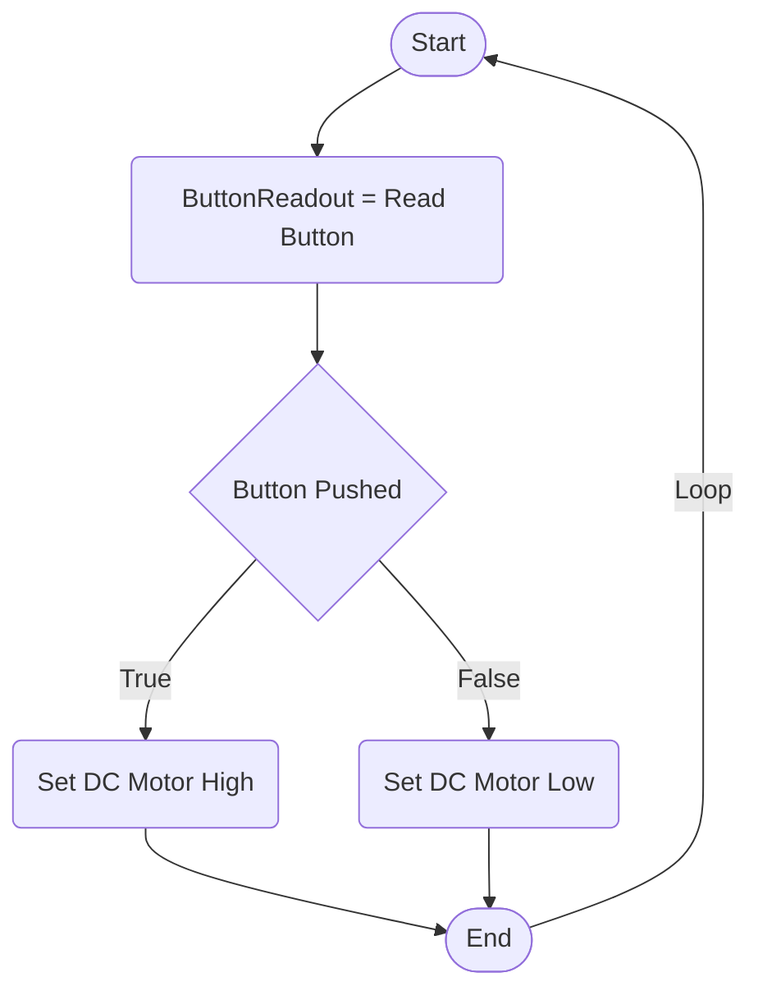

```mermaid 
flowchart TD
terminalStart([Start])
terminalEnd([End])

ReadButton(ButtonReadout = Read Button)
if{Button Pushed}
DCon(Set DC Motor High)
DCoff(Set DC Motor Low)

terminalStart --> ReadButton --> if
if --> |True| DCon --> terminalEnd
if --> |False| DCoff --> terminalEnd
terminalEnd --> |Loop|terminalStart
```

```mermaid 
flowchart TD
terminalStart([Start])
terminalEnd([End])

ReadBuzzer(BuzzerrReadout = Read Sonar)
if{Buzzer Triggerd}
BZon(Set Buzzer High)
BZoff(Set Buzzer Low)

terminalStart --> ReadBuzzer --> if
if --> |True| BZon --> terminalEnd
if --> |False| BZoff --> terminalEnd
terminalEnd --> |Loop|terminalStart


```