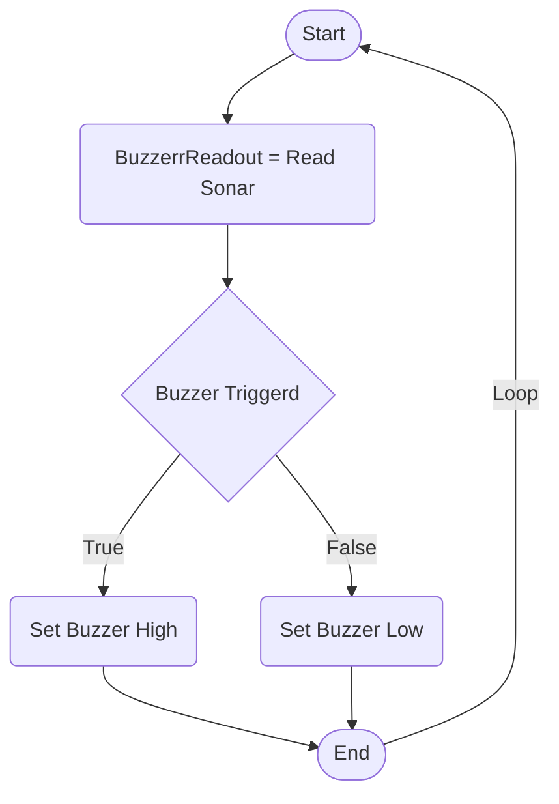
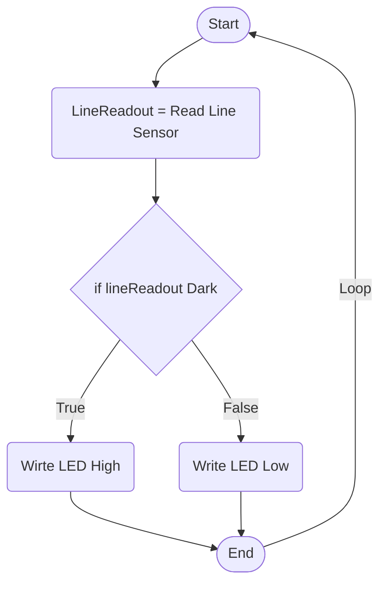
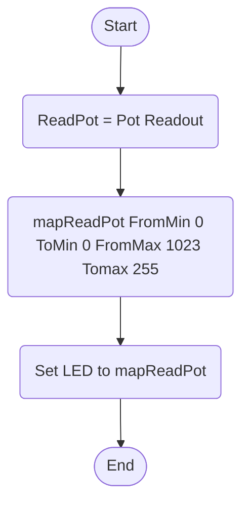
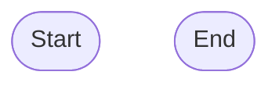

```mermaid 
flowchart TD
terminalStart([Start])
terminalEnd([End])

ReadButton(ButtonReadout = Read Button)
if{Button Pushed}
DCon(Set DC Motor High)
DCoff(Set DC Motor Low)

terminalStart --> ReadButton --> if
if --> |True| DCon --> terminalEnd
if --> |False| DCoff --> terminalEnd
terminalEnd --> |Loop|terminalStart
```

```mermaid 
flowchart TD
terminalStart([Start])
terminalEnd([End])

ReadBuzzer(BuzzerrReadout = Read Sonar)
if{Buzzer Triggerd}
BZon(Set Buzzer High)
BZoff(Set Buzzer Low)

terminalStart --> ReadBuzzer --> if
if --> |True| BZon --> terminalEnd
if --> |False| BZoff --> terminalEnd
terminalEnd --> |Loop|terminalStart


```

```mermaid
flowchart TD
terminalStart([Start])
terminalEnd([End])

lineRead(LineReadout = Read Line Sensor)
if{if lineReadout Dark}
ledHigh(Wirte LED High)
ledLow(Write LED Low)

terminalStart --> lineRead 
lineRead --> if
if -->|True| ledHigh
if -->|False| ledLow
ledHigh -->terminalEnd
ledLow --> terminalEnd([End])
terminalEnd --> |Loop|terminalStart
```

```mermaid
flowchart TD
terminalStart([Start])
terminalEnd([End])

ReadPot(ReadPot = Pot Readout)
Map(mapReadPot FromMin 0 ToMin 0 FromMax 1023 Tomax 255)
led(Set LED to mapReadPot)

terminalStart([Start]) --> ReadPot
ReadPot --> Map
Map --> led
led --> terminalEnd([End])
```

```mermaid
flowchart TD
terminalStart([Start])
terminalEnd([End])


```